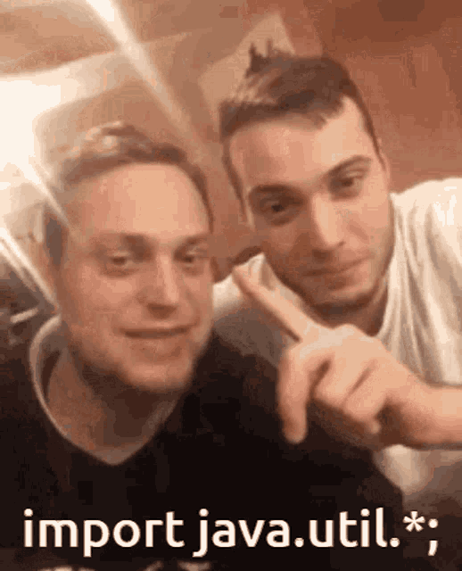

# ICE PROJECT 2025

##                                      Funktionelle krav
#                                     Dødens Labyrint Spil

Spillet er et tekst baseret spil i bog format som ønskes at lave om om til et computer spil.
Spillet skal kunne vise de forskellige cases. case 1 er spillet første Action Point.
Et Action Point er tilsvarende et rum som interregere med spilleren. som feks.
      - At gå i kamp med et væsen
      - Få genstande / miste genstande
      - Ændre spillerens stats
      - etc.

#                                        Database  

Der skal oprettes en database hvor hvert Action Point kan gemmes og tilgås senere i koden.
Spilleren skal kunne lave en bruger der senere gemmes til databasen ved lukning af spil.    
Spilleren har udholdenhed, evne, held, startdrik, inventory, guld, mad.

#                                         Kamp

Under kamp i hver runde er det enten spilleren eller væsnet som kan trække udholdenhed fra den anden
Der trækkes 2 udholdenhed fra den der har det laveste attack point, 
Kampen er til døden -medmindre andet er beskrevet i Action Pointen
Der er visse væsner som udgør en undtagelse 

#                                   De visuelle krav:

Der ønskes et interface som bruger kan interregere med og trykke sig igennem spilet med.
Alt tilknyttet spilleren skal kunne vises og opdateres.
Interfacet skal visualisere terning rul hvis der er behov for det bestemt af det Action Point spilleren står på.
Interfacet skal også indikere når man er i combat og brugeren skal aktivt trykke på en knap for igangsætte kampen.

Alle spil mekaniker er forklaret i første kapitel af bogen
Der ønskes mulighed for at bruge koden som skelet til at lave andre bøger til computer spil. 

This ICE Project is owned and written by Daniel, Frederik, Luke and Emil from DAT sem1 2025 winter start: CPH-l-dat-da 0225a - Sem1

## Intentions with the project:

1. To create a text adventure game based on a pre existing book and use that as the user requirements.

2. The group strives towards using databases and SQL to interact with given databases. Furthermore it is the ambition of the group to make use of JAVAFX to create a GUI

3. To make use of good practice in the design and development fases.

4. To challenge ourselves with the writing of the code to go above and beyond.

5.

